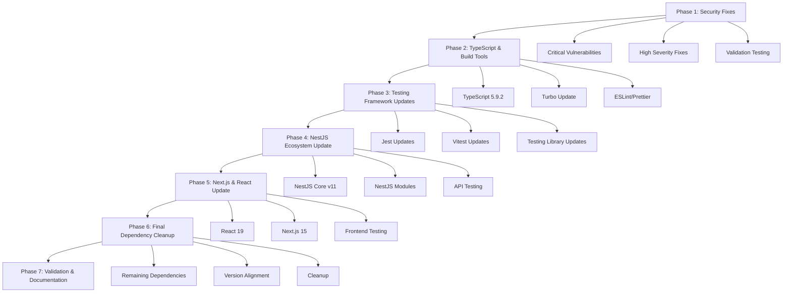

# Design Document

## Overview

This design outlines a systematic approach to modernizing the StrengthOS monorepo by addressing security vulnerabilities and updating dependencies across all active applications and shared libraries. The modernization will be executed in carefully planned phases to minimize risk and ensure system stability throughout the process.

The design prioritizes security fixes first, followed by major framework updates, and concludes with comprehensive testing and validation. Each phase includes rollback procedures and validation checkpoints to ensure system integrity.

## Architecture

### Modernization Strategy

The modernization follows a **phased approach** with the following principles:

1. **Security First**: Address critical and high-severity vulnerabilities immediately
2. **Incremental Updates**: Update dependencies in logical groups to minimize breaking changes
3. **Validation Gates**: Test thoroughly after each phase before proceeding
4. **Rollback Ready**: Maintain ability to rollback at each phase boundary
5. **Workspace Isolation**: Update shared libraries before consuming applications

### Phase Structure



## Components and Interfaces

### Workspace Structure

The monorepo contains the following active components (excluding legacy human-lift-training-fe):

**Applications:**
- `apps/sos-web-api` - NestJS REST API
- `apps/sos-web-training` - Next.js frontend

**Shared Libraries:**
- `libs/shared-cache` - Caching utilities
- `libs/shared-database` - Database abstractions
- `libs/shared-external` - External service integrations
- `libs/shared-i18n` - Internationalization
- `libs/shared-logging` - Logging utilities
- `libs/shared-middleware` - Common middleware
- `libs/shared-monitoring` - Monitoring and metrics
- `libs/shared-notifications` - Notification services
- `libs/shared-security` - Security utilities
- `libs/shared-testing` - Testing utilities
- `libs/shared-types` - TypeScript type definitions
- `libs/shared-ui` - UI components
- `libs/shared-utils` - General utilities
- `libs/shared-validation` - Validation schemas

### Update Dependency Matrix

| Component | Current Version | Target Version | Breaking Changes | Risk Level |
|-----------|----------------|----------------|------------------|------------|
| Next.js | 14.2.0 | 15.5.2 | Yes | High |
| NestJS | 10.x | 11.x | Yes | High |
| React | 18.x | 19.x | Yes | Medium |
| TypeScript | 5.7.2/5.8.3 | 5.9.2 | No | Low |
| Jest | 29.x | 30.x | Yes | Medium |
| Vitest | 1.6.1 | 3.2.4 | Yes | Medium |
| Turbo | 1.13.4 | 2.5.6 | Yes | Medium |

### Security Vulnerability Prioritization

**Critical (1):**
- Next.js security vulnerabilities - Immediate fix required

**High (32):**
- faker.js removal of functional code
- html-minifier REDoS vulnerability
- mjml-related vulnerabilities
- tmp arbitrary file write vulnerability

**Moderate (4):**
- esbuild development server vulnerability
- cookie out-of-bounds characters

## Data Models

### Update Tracking Schema

```typescript
interface UpdatePhase {
  id: string;
  name: string;
  status: 'pending' | 'in-progress' | 'completed' | 'failed' | 'rolled-back';
  dependencies: PackageUpdate[];
  validationChecks: ValidationCheck[];
  rollbackProcedure: RollbackStep[];
  startTime?: Date;
  completionTime?: Date;
}

interface PackageUpdate {
  packageName: string;
  currentVersion: string;
  targetVersion: string;
  workspace: string[];
  breakingChanges: boolean;
  securityFix: boolean;
  migrationRequired: boolean;
}

interface ValidationCheck {
  type: 'build' | 'test' | 'lint' | 'typecheck' | 'e2e';
  workspace: string;
  status: 'pending' | 'passed' | 'failed';
  details?: string;
}

interface RollbackStep {
  action: string;
  command: string;
  workspace?: string;
  order: number;
}
```

### Workspace Configuration Updates

```typescript
interface WorkspaceConfig {
  name: string;
  path: string;
  packageManager: 'npm';
  dependencies: Record<string, string>;
  devDependencies: Record<string, string>;
  peerDependencies?: Record<string, string>;
  scripts: Record<string, string>;
  updateStrategy: 'conservative' | 'aggressive';
}
```

## Error Handling

### Rollback Procedures

Each phase includes automated rollback capabilities:

1. **Git-based Rollback**: Each phase creates a git commit for easy reversion
2. **Package Lock Restoration**: Backup and restore package-lock.json files
3. **Configuration Rollback**: Revert configuration changes in reverse order
4. **Validation Rollback**: Re-run tests to ensure rollback success

### Error Recovery Strategies

```typescript
enum ErrorType {
  BUILD_FAILURE = 'build_failure',
  TEST_FAILURE = 'test_failure',
  DEPENDENCY_CONFLICT = 'dependency_conflict',
  BREAKING_CHANGE = 'breaking_change',
  SECURITY_REGRESSION = 'security_regression'
}

interface ErrorRecovery {
  errorType: ErrorType;
  detectionMethod: string;
  automaticRecovery: boolean;
  recoverySteps: string[];
  escalationRequired: boolean;
}
```

### Validation Checkpoints

After each phase:
1. **Build Validation**: All workspaces must build successfully
2. **Test Validation**: All tests must pass
3. **Type Validation**: TypeScript compilation must succeed
4. **Security Validation**: No new vulnerabilities introduced
5. **Performance Validation**: No significant performance regression

## Testing Strategy

### Pre-Update Testing

1. **Baseline Establishment**: Run full test suite and document results
2. **Performance Benchmarking**: Establish current performance metrics
3. **Security Scanning**: Document current vulnerability state
4. **Dependency Analysis**: Map current dependency tree

### Phase Testing

Each phase includes:

1. **Unit Testing**: All existing unit tests must pass
2. **Integration Testing**: API endpoints and service integrations
3. **Component Testing**: UI component functionality
4. **Build Testing**: Successful compilation across all workspaces
5. **Security Testing**: Vulnerability scanning after updates

### Post-Update Validation

1. **End-to-End Testing**: Complete user workflows
2. **Performance Testing**: Ensure no regression in key metrics
3. **Security Validation**: Confirm vulnerability resolution
4. **Compatibility Testing**: Cross-workspace dependency validation

### Test Automation Strategy

```typescript
interface TestSuite {
  phase: string;
  tests: {
    unit: TestConfig[];
    integration: TestConfig[];
    e2e: TestConfig[];
    security: TestConfig[];
    performance: TestConfig[];
  };
  passThreshold: number; // Percentage of tests that must pass
  criticalTests: string[]; // Tests that must pass for phase completion
}

interface TestConfig {
  name: string;
  workspace: string;
  command: string;
  timeout: number;
  retries: number;
  critical: boolean;
}
```

### Continuous Integration Integration

The update process integrates with existing CI/CD:

1. **Branch Strategy**: Each phase uses feature branches
2. **Automated Testing**: CI runs full test suite on each phase
3. **Security Scanning**: Automated vulnerability scanning
4. **Performance Monitoring**: Automated performance regression detection
5. **Deployment Gates**: Manual approval required for production deployment

### Risk Mitigation

1. **Incremental Deployment**: Deploy updates to staging first
2. **Feature Flags**: Use feature flags for major changes
3. **Monitoring**: Enhanced monitoring during update phases
4. **Rollback Triggers**: Automated rollback on critical failures
5. **Communication Plan**: Stakeholder notification for each phase

This design ensures a systematic, safe, and thorough modernization of the monorepo while maintaining system stability and providing clear rollback paths at every stage.