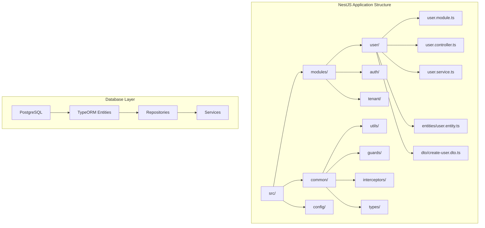

# Design Document: Naming Standards and Legacy Migration

## Overview

This design outlines a comprehensive approach to standardize naming conventions across the codebase and migrate legacy patterns to modern NestJS and PostgreSQL standards. The solution addresses the current inconsistencies between legacy dependency injection patterns, mixed naming conventions, and the need to establish a unified, maintainable codebase structure.

### Current State Analysis

Based on codebase analysis, the following inconsistencies have been identified:

- **Mixed DI Patterns**: Legacy `@injectable()` decorators alongside NestJS `@Injectable()` patterns
- **Interface Naming**: Mix of `I` prefixed interfaces (`IUserService`) and non-prefixed interfaces
- **Directory Structure**: Inconsistent organization between `human-lift-training-api`, `human-lift-training-monorepo`, and `apps/hos-web-api`
- **Service Registration**: Manual DI container registration vs NestJS module-based dependency injection
- **File Naming**: Mix of PascalCase and kebab-case file names

## Architecture

### Migration Strategy

The migration will follow a **phased approach** to minimize disruption:

1. **Phase 1**: Establish naming standards and tooling
2. **Phase 2**: Migrate core shared types and utilities
3. **Phase 3**: Consolidate service patterns to NestJS
4. **Phase 4**: Standardize database patterns with TypeORM
5. **Phase 5**: Implement automated enforcement

### Target Architecture



## Components and Interfaces

### 1. Naming Convention Engine

**Purpose**: Automated detection and enforcement of naming standards

**Core Components**:
- `NamingValidator`: Validates file and code element naming
- `LegacyPatternDetector`: Identifies legacy patterns requiring migration
- `ConventionEnforcer`: ESLint rules and build-time validation

**Interface**:
```typescript
interface NamingConventionConfig {
  fileNaming: {
    directories: 'kebab-case';
    components: 'kebab-case';
    tests: 'kebab-case.spec.ts';
  };
  codeNaming: {
    classes: 'PascalCase';
    interfaces: 'PascalCase'; // No 'I' prefix
    enums: 'PascalCase';
    enumValues: 'SCREAMING_SNAKE_CASE';
    functions: 'camelCase';
    variables: 'camelCase';
    constants: 'SCREAMING_SNAKE_CASE';
  };
  nestjsPatterns: {
    controllers: 'PascalCase + Controller';
    services: 'PascalCase + Service';
    modules: 'PascalCase + Module';
    entities: 'PascalCase + Entity';
    dtos: 'PascalCase + Dto';
  };
}
```

### 2. Legacy Migration Engine

**Purpose**: Systematic migration of legacy patterns to modern standards

**Core Components**:
- `DependencyInjectionMigrator`: Converts legacy DI to NestJS patterns
- `InterfaceMigrator`: Removes 'I' prefixes and updates references
- `ServicePatternMigrator`: Converts to NestJS service patterns
- `FileStructureMigrator`: Reorganizes files to NestJS conventions

**Migration Patterns**:
```typescript
// Legacy Pattern
@injectable()
export class UserService implements IUserService {
  constructor(@inject('IDb') private db: IDb) {}
}

// Target NestJS Pattern
@Injectable()
export class UserService {
  constructor(
    @InjectRepository(User)
    private userRepository: Repository<User>
  ) {}
}
```

### 3. Database Standardization

**Purpose**: Establish consistent PostgreSQL and TypeORM patterns

**Core Components**:
- `EntityStandardizer`: Ensures consistent entity definitions
- `MigrationNormalizer`: Standardizes migration file naming and structure
- `RepositoryPatternEnforcer`: Implements consistent repository patterns

**Entity Pattern**:
```typescript
@Entity('users') // snake_case table name
export class User {
  @PrimaryGeneratedColumn('uuid')
  id: string;

  @Column({ name: 'first_name' }) // snake_case column
  firstName: string; // camelCase property

  @Column({ name: 'created_at' })
  createdAt: Date;
}
```

### 4. API Standardization

**Purpose**: Consistent API patterns and naming

**Core Components**:
- `ControllerStandardizer`: Ensures consistent controller patterns
- `DTOValidator`: Validates DTO naming and structure
- `RouteNormalizer`: Standardizes route naming conventions

**Controller Pattern**:
```typescript
@Controller('users') // kebab-case route
export class UserController {
  @Post()
  async createUser(@Body() createUserDto: CreateUserDto): Promise<UserResponseDto> {
    // camelCase method, PascalCase DTOs
  }
}
```

## Data Models

### Migration Tracking

```typescript
interface MigrationTask {
  id: string;
  type: MigrationTaskType;
  filePath: string;
  currentPattern: string;
  targetPattern: string;
  status: MigrationStatus;
  dependencies: string[];
  estimatedEffort: number;
}

enum MigrationTaskType {
  FILE_RENAME = 'FILE_RENAME',
  INTERFACE_MIGRATION = 'INTERFACE_MIGRATION',
  SERVICE_MIGRATION = 'SERVICE_MIGRATION',
  DI_MIGRATION = 'DI_MIGRATION',
  ENTITY_MIGRATION = 'ENTITY_MIGRATION'
}

enum MigrationStatus {
  PENDING = 'PENDING',
  IN_PROGRESS = 'IN_PROGRESS',
  COMPLETED = 'COMPLETED',
  BLOCKED = 'BLOCKED'
}
```

### Naming Standard Definitions

```typescript
interface NamingStandard {
  pattern: RegExp;
  description: string;
  examples: string[];
  violations: string[];
  autoFixable: boolean;
}

interface FileNamingRules {
  controllers: NamingStandard;
  services: NamingStandard;
  modules: NamingStandard;
  entities: NamingStandard;
  dtos: NamingStandard;
  interfaces: NamingStandard;
  enums: NamingStandard;
  utilities: NamingStandard;
}
```

## Error Handling

### Migration Error Recovery

```typescript
interface MigrationError {
  taskId: string;
  errorType: MigrationErrorType;
  message: string;
  filePath: string;
  lineNumber?: number;
  recoveryStrategy: RecoveryStrategy;
}

enum MigrationErrorType {
  CIRCULAR_DEPENDENCY = 'CIRCULAR_DEPENDENCY',
  NAMING_CONFLICT = 'NAMING_CONFLICT',
  BREAKING_CHANGE = 'BREAKING_CHANGE',
  SYNTAX_ERROR = 'SYNTAX_ERROR'
}

enum RecoveryStrategy {
  MANUAL_INTERVENTION = 'MANUAL_INTERVENTION',
  AUTOMATIC_RETRY = 'AUTOMATIC_RETRY',
  SKIP_WITH_WARNING = 'SKIP_WITH_WARNING',
  ROLLBACK = 'ROLLBACK'
}
```

### Validation Error Handling

- **Build-time validation**: Fail builds on critical naming violations
- **Runtime warnings**: Log warnings for deprecated patterns
- **IDE integration**: Real-time feedback through ESLint and TypeScript
- **CI/CD integration**: Automated checks in pull requests

## Testing Strategy

### 1. Unit Testing

- **Naming Validator Tests**: Verify correct pattern detection
- **Migration Engine Tests**: Test individual migration transformations
- **Convention Enforcer Tests**: Validate ESLint rule effectiveness

### 2. Integration Testing

- **End-to-end Migration Tests**: Full migration workflow validation
- **Backward Compatibility Tests**: Ensure existing functionality remains intact
- **Performance Tests**: Validate migration performance on large codebases

### 3. Regression Testing

- **Before/After Comparisons**: Ensure functional equivalence post-migration
- **API Contract Tests**: Verify API behavior remains consistent
- **Database Schema Tests**: Validate database integrity after migrations

### 4. Automated Testing Infrastructure

```typescript
interface TestSuite {
  namingValidation: {
    fileNamingTests: TestCase[];
    codeNamingTests: TestCase[];
    nestjsPatternTests: TestCase[];
  };
  migrationTests: {
    legacyToNestjsTests: TestCase[];
    interfaceMigrationTests: TestCase[];
    databaseMigrationTests: TestCase[];
  };
  regressionTests: {
    functionalityTests: TestCase[];
    performanceTests: TestCase[];
    compatibilityTests: TestCase[];
  };
}
```

## Implementation Phases

### Phase 1: Foundation (Week 1-2)
- Establish naming convention configuration
- Implement basic validation tooling
- Create migration task tracking system

### Phase 2: Core Migration (Week 3-4)
- Migrate shared types and interfaces
- Standardize service patterns
- Update dependency injection patterns

### Phase 3: Database Standardization (Week 5-6)
- Migrate to TypeORM entities
- Standardize migration patterns
- Update repository implementations

### Phase 4: API Standardization (Week 7-8)
- Standardize controller patterns
- Migrate DTO definitions
- Update route naming conventions

### Phase 5: Automation & Enforcement (Week 9-10)
- Implement automated validation
- Set up CI/CD integration
- Create developer tooling and documentation

## Tooling and Automation

### ESLint Rules
```typescript
// Custom ESLint rules for naming enforcement
const namingRules = {
  '@custom/nestjs-class-naming': 'error',
  '@custom/interface-naming': 'error',
  '@custom/file-naming': 'error',
  '@custom/database-naming': 'error'
};
```

### Build Integration
```typescript
// Webpack plugin for build-time validation
class NamingStandardPlugin {
  apply(compiler: Compiler) {
    compiler.hooks.compilation.tap('NamingStandardPlugin', (compilation) => {
      // Validate naming standards during build
    });
  }
}
```

### IDE Integration
- VSCode extension for real-time naming validation
- Auto-fix suggestions for common violations
- Migration progress tracking in IDE

This design provides a comprehensive, phased approach to standardizing naming conventions while maintaining system stability and developer productivity throughout the migration process.