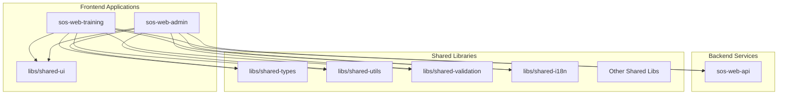

# Design Document

## Overview

This design outlines the migration of the existing `human-lift-training-fe` application into a new monorepo-integrated Next.js application called `sos-web-training`. The migration involves creating a new app structure, establishing a shared UI library, integrating with the existing `sos-web-api` backend, and ensuring proper separation between user/coach functionality and admin functionality.

The design follows the established monorepo patterns used by `sos-web-api` and leverages the existing shared libraries for consistency, maintainability, and code reuse across the platform.

## Architecture

### High-Level Architecture



### Directory Structure

```
apps/
├── sos-web-api/           # Existing backend API
└── sos-web-training/      # New frontend app
    ├── src/
    │   ├── app/           # Next.js app router pages
    │   ├── components/    # App-specific components
    │   ├── hooks/         # Custom React hooks
    │   ├── lib/           # App utilities and configurations
    │   └── types/         # App-specific types
    ├── public/            # Static assets
    ├── package.json
    ├── next.config.ts
    ├── tailwind.config.ts
    └── tsconfig.json

libs/
├── shared-ui/             # New shared UI library
│   ├── src/
│   │   ├── components/    # Reusable UI components
│   │   ├── hooks/         # Shared React hooks
│   │   ├── utils/         # UI-related utilities
│   │   └── index.ts       # Main exports
│   ├── package.json
│   └── tsconfig.json
├── shared-types/          # Existing shared types
├── shared-utils/          # Existing shared utilities
├── shared-validation/     # Existing shared validation
└── shared-i18n/           # Existing internationalization library
```

## Components and Interfaces

### Shared UI Library (libs/shared-ui)

The shared UI library will contain reusable components that can be used across multiple applications:

**Core Components:**
- Navigation components (Navbar, Sidebar, Breadcrumb)
- Basic UI elements (Buttons, Inputs, Cards, Modals)
- Layout components (Container, Grid, Flex)
- Form components (FormField, FormGroup, ValidationMessage)
- Exercise and Equipment components (ExerciseList, EquipmentList)
- Workout components (WorkoutSession with customization capabilities)

**Component Structure:**
```typescript
// libs/shared-ui/src/components/Button/Button.tsx
export interface ButtonProps {
  variant?: 'primary' | 'secondary' | 'danger';
  size?: 'sm' | 'md' | 'lg';
  disabled?: boolean;
  loading?: boolean;
  children: React.ReactNode;
  onClick?: () => void;
}

export const Button: React.FC<ButtonProps> = ({ ... }) => {
  // Implementation using Tailwind CSS classes
};

// libs/shared-ui/src/components/ExerciseList/ExerciseList.tsx
export interface ExerciseListProps {
  exercises: ExerciseDto[];
  selectable?: boolean;
  customizable?: boolean;
  onSelect?: (exercise: ExerciseDto) => void;
  onCustomize?: (exercise: ExerciseDto, customization: any) => void;
  renderCustomization?: (exercise: ExerciseDto) => React.ReactNode;
}

export const ExerciseList: React.FC<ExerciseListProps> = ({ ... }) => {
  // Implementation with selection and customization capabilities
};
```

**Export Pattern:**
```typescript
// libs/shared-ui/src/index.ts
export { Button } from './components/Button';
export { Navbar } from './components/Navbar';
export { Sidebar } from './components/Sidebar';
export { ExerciseList } from './components/ExerciseList';
export { EquipmentList } from './components/EquipmentList';
export { WorkoutSession } from './components/WorkoutSession';
// ... other exports
```

### App-Specific Components (apps/sos-web-training)

Application-specific components that are not reusable across apps:

**Training-Specific Components:**
- WorkoutCalendar (training app specific)

**Shared Components (used by both training and admin apps):**
- ExerciseList (selectable and customizable in training app)
- EquipmentList (selectable and customizable in training app)  
- WorkoutSession components (selectable and customizable in training app)

**Component Migration Strategy:**
1. Analyze each component from `human-lift-training-fe/src/components`
2. Determine if component is reusable (move to shared-ui) or app-specific (keep in app)
3. Move ExerciseList, EquipmentList, and WorkoutSession components to shared-ui with customization props
4. Ensure shared components support selection and customization features for training app
5. Refactor to use shared UI components where appropriate
6. Update imports and dependencies

### API Integration Layer

**API Client Configuration:**
```typescript
// apps/sos-web-training/src/lib/api-client.ts
import { ApiClient } from '@strengthos/shared-external';

export const apiClient = new ApiClient({
  baseURL: process.env.NEXT_PUBLIC_API_URL,
  timeout: 10000,
});
```

**Type-Safe API Hooks:**
```typescript
// apps/sos-web-training/src/hooks/useWorkouts.ts
import { useQuery } from '@tanstack/react-query';
import { WorkoutDto } from '@strengthos/shared-types';
import { apiClient } from '../lib/api-client';

export const useWorkouts = () => {
  return useQuery<WorkoutDto[]>({
    queryKey: ['workouts'],
    queryFn: () => apiClient.get('/workouts'),
  });
};
```

## Internationalization (i18n) Architecture

### Shared-i18n Integration

The application will leverage the existing `@strengthos/shared-i18n` library for comprehensive internationalization support across English and Thai languages.

**I18n Service Configuration:**
```typescript
// apps/sos-web-training/src/lib/i18n-config.ts
import { I18nService } from '@strengthos/shared-i18n';

export const i18nService = new I18nService({
  defaultLocale: 'en-US',
  fallbackLocale: 'en-US',
  supportedLocales: ['en-US', 'th-TH'],
  cacheEnabled: true,
  cacheTTL: 3600000, // 1 hour
  lazyLoading: false,
});
```

**React Context Integration:**
```typescript
// apps/sos-web-training/src/contexts/I18nContext.tsx
import React, { createContext, useContext, useState, useEffect } from 'react';
import { I18nService, I18nContext as I18nContextType } from '@strengthos/shared-i18n';

interface I18nProviderProps {
  children: React.ReactNode;
  i18nService: I18nService;
}

const I18nContext = createContext<{
  context: I18nContextType;
  translate: (key: string, options?: any) => string;
  setLocale: (locale: string) => void;
} | null>(null);

export const I18nProvider: React.FC<I18nProviderProps> = ({ children, i18nService }) => {
  const [context, setContext] = useState<I18nContextType>({
    locale: 'en-US',
    fallbackLocale: 'en-US',
    timeZone: 'UTC',
    currency: 'USD',
    weightUnit: 'KG',
    direction: 'ltr',
    region: 'US',
  });

  const translate = (key: string, options: any = {}) => {
    return i18nService.translate(key, { locale: context.locale, ...options });
  };

  const setLocale = (locale: string) => {
    setContext(prev => ({ ...prev, locale }));
  };

  return (
    <I18nContext.Provider value={{ context, translate, setLocale }}>
      {children}
    </I18nContext.Provider>
  );
};

export const useI18n = () => {
  const context = useContext(I18nContext);
  if (!context) {
    throw new Error('useI18n must be used within an I18nProvider');
  }
  return context;
};
```

**Translation Hooks:**
```typescript
// apps/sos-web-training/src/hooks/useTranslation.ts
import { useI18n } from '../contexts/I18nContext';

export const useTranslation = (namespace?: string) => {
  const { translate, context } = useI18n();

  const t = (key: string, options: any = {}) => {
    const fullKey = namespace ? `${namespace}.${key}` : key;
    return translate(fullKey, options);
  };

  return { t, locale: context.locale };
};

// apps/sos-web-training/src/hooks/useLocale.ts
import { useI18n } from '../contexts/I18nContext';
import { detectLocaleFromRequest, validateLocale } from '@strengthos/shared-i18n';

export const useLocale = () => {
  const { context, setLocale } = useI18n();

  const changeLocale = (newLocale: string) => {
    if (validateLocale(newLocale)) {
      setLocale(newLocale);
      // Save to localStorage or user preferences
      localStorage.setItem('preferred-locale', newLocale);
    }
  };

  const detectBrowserLocale = () => {
    const detected = detectLocaleFromRequest({
      acceptLanguageHeader: navigator.language,
      defaultLocale: 'en-US',
      supportedLocales: ['en-US', 'th-TH'],
    });
    return detected;
  };

  return {
    locale: context.locale,
    changeLocale,
    detectBrowserLocale,
    context,
  };
};
```

**Formatting Integration:**
```typescript
// apps/sos-web-training/src/hooks/useFormatting.ts
import { useI18n } from '../contexts/I18nContext';
import { 
  formatDate, 
  formatTime, 
  formatNumber, 
  formatCurrency, 
  formatWeight 
} from '@strengthos/shared-i18n';

export const useFormatting = () => {
  const { context } = useI18n();

  return {
    formatDate: (date: Date) => formatDate(date, { locale: context.locale }),
    formatTime: (date: Date) => formatTime(date, { locale: context.locale }),
    formatNumber: (num: number) => formatNumber(num, { locale: context.locale }),
    formatCurrency: (amount: number) => formatCurrency(amount, { 
      locale: context.locale, 
      currency: context.currency 
    }),
    formatWeight: (weight: number) => formatWeight(weight, { 
      locale: context.locale, 
      weightUnit: context.weightUnit 
    }),
  };
};
```

**Language Switcher Component:**
```typescript
// apps/sos-web-training/src/components/LanguageSwitcher.tsx
import React from 'react';
import { useLocale } from '../hooks/useLocale';
import { getSupportedLocales } from '@strengthos/shared-i18n';

export const LanguageSwitcher: React.FC = () => {
  const { locale, changeLocale } = useLocale();
  const supportedLocales = getSupportedLocales();

  return (
    <select 
      value={locale} 
      onChange={(e) => changeLocale(e.target.value)}
      className="px-3 py-2 border rounded-md"
    >
      {supportedLocales.map((loc) => (
        <option key={loc.code} value={loc.code}>
          {loc.nativeName}
        </option>
      ))}
    </select>
  );
};
```

**Translation Key Management:**
```typescript
// apps/sos-web-training/src/translations/keys.ts
export const TRANSLATION_KEYS = {
  // Navigation
  NAV: {
    DASHBOARD: 'nav.dashboard',
    WORKOUTS: 'nav.workouts',
    EXERCISES: 'nav.exercises',
    PROFILE: 'nav.profile',
  },
  
  // Common UI
  COMMON: {
    LOADING: 'common.loading',
    SAVE: 'common.save',
    CANCEL: 'common.cancel',
    DELETE: 'common.delete',
    EDIT: 'common.edit',
  },
  
  // Workout specific
  WORKOUT: {
    CREATE: 'workout.create',
    EDIT: 'workout.edit',
    DELETE: 'workout.delete',
    COUNT: 'workout.count', // Supports pluralization
  },
  
  // Form validation
  VALIDATION: {
    REQUIRED: 'validation.required',
    INVALID_EMAIL: 'validation.invalidEmail',
    MIN_LENGTH: 'validation.minLength',
  },
} as const;
```

**API Integration with Locale Headers:**
```typescript
// apps/sos-web-training/src/lib/api-client.ts
import { ApiClient } from '@strengthos/shared-external';
import { useLocale } from '../hooks/useLocale';

export const createApiClient = (locale: string) => {
  return new ApiClient({
    baseURL: process.env.NEXT_PUBLIC_API_URL,
    timeout: 10000,
    headers: {
      'Accept-Language': locale,
      'Content-Language': locale,
    },
  });
};

// Usage in hooks
export const useApiClient = () => {
  const { locale } = useLocale();
  return createApiClient(locale);
};
```

## Data Models

### Shared Types Integration

The application will leverage existing shared types from `@strengthos/shared-types`:

```typescript
// Usage in components
import { 
  UserDto, 
  WorkoutDto, 
  ExerciseDto,
  CoachDto 
} from '@strengthos/shared-types';
```

### App-Specific Types

```typescript
// apps/sos-web-training/src/types/app.ts
export interface AppState {
  user: UserDto | null;
  currentWorkout: WorkoutDto | null;
  isLoading: boolean;
}

export interface NavigationItem {
  label: string;
  href: string;
  icon?: React.ComponentType;
  roles: ('user' | 'coach')[];
}
```

## Error Handling

### Global Error Boundary

```typescript
// apps/sos-web-training/src/components/ErrorBoundary.tsx
export class ErrorBoundary extends React.Component {
  // Implementation with error logging to shared-logging
}
```

### API Error Handling

```typescript
// apps/sos-web-training/src/lib/error-handler.ts
import { ApiError } from '@strengthos/shared-types';

export const handleApiError = (error: ApiError) => {
  // Centralized error handling logic
  // Integration with shared-logging
  // User-friendly error messages
};
```

### Form Validation

Integration with existing shared validation:

```typescript
// apps/sos-web-training/src/hooks/useFormValidation.ts
import { validateWorkout } from '@strengthos/shared-validation';

export const useWorkoutForm = () => {
  // Form handling with shared validation
};
```

## Testing Strategy

### Unit Testing

**Shared UI Components:**
```typescript
// libs/shared-ui/src/components/Button/Button.test.tsx
import { render, screen } from '@testing-library/react';
import { Button } from './Button';

describe('Button', () => {
  it('renders with correct variant classes', () => {
    // Test implementation
  });
});
```

**App Components:**
```typescript
// apps/sos-web-training/src/components/WorkoutCalendar/WorkoutCalendar.test.tsx
import { render } from '@testing-library/react';
import { WorkoutCalendar } from './WorkoutCalendar';

describe('WorkoutCalendar', () => {
  // Test implementation
});
```

### Integration Testing

**API Integration:**
```typescript
// apps/sos-web-training/src/__tests__/api-integration.test.ts
describe('API Integration', () => {
  it('should fetch workouts successfully', async () => {
    // Mock API responses
    // Test API client integration
  });
});
```

### E2E Testing

**User Workflows:**
```typescript
// apps/sos-web-training/e2e/workout-flow.spec.ts
describe('Workout Management Flow', () => {
  it('should allow user to create and view workouts', async () => {
    // E2E test implementation
  });
});
```

## Build and Deployment Configuration

### Package.json Configuration

```json
{
  "name": "@strengthos/sos-web-training",
  "version": "1.0.0",
  "private": true,
  "scripts": {
    "dev": "next dev --turbopack",
    "build": "next build",
    "start": "next start",
    "lint": "next lint",
    "test": "jest",
    "test:watch": "jest --watch",
    "typecheck": "tsc --noEmit"
  },
  "dependencies": {
    "@strengthos/shared-ui": "file:../../libs/shared-ui",
    "@strengthos/shared-types": "file:../../libs/shared-types",
    "@strengthos/shared-utils": "file:../../libs/shared-utils",
    "@strengthos/shared-validation": "file:../../libs/shared-validation",
    "@strengthos/shared-i18n": "file:../../libs/shared-i18n"
  }
}
```

### Turbo Configuration Updates

```json
{
  "pipeline": {
    "build": {
      "dependsOn": ["^build"],
      "outputs": [".next/**"]
    },
    "dev": {
      "cache": false,
      "persistent": true
    }
  }
}
```

### Docker Configuration

```dockerfile
# apps/sos-web-training/Dockerfile
FROM node:20-alpine AS base
# Multi-stage build configuration
# Similar to sos-web-api patterns
```

## Security Considerations

### Authentication Integration

```typescript
// apps/sos-web-training/src/lib/auth.ts
import { AuthService } from '@strengthos/shared-security';

export const authConfig = {
  // JWT token handling
  // Role-based access control
  // Session management
};
```

### Route Protection

```typescript
// apps/sos-web-training/src/middleware.ts
import { NextRequest } from 'next/server';
import { withAuth } from '@strengthos/shared-security';

export default withAuth((req: NextRequest) => {
  // Route protection logic
  // Role-based redirects
});
```

## Performance Optimization

### Code Splitting

- Implement dynamic imports for large components
- Route-based code splitting with Next.js
- Lazy loading for non-critical components

### Bundle Optimization

- Tree shaking for shared libraries
- Proper externalization of shared dependencies
- Optimized build configuration

### Caching Strategy

- Static asset caching
- API response caching with React Query
- Build-time optimization with Turbo

## Migration Strategy

### Phase 1: Infrastructure Setup
1. Create new app structure
2. Set up shared-ui library
3. Configure build pipeline
4. Establish API integration

### Phase 2: Component Migration
1. Migrate reusable components to shared-ui
2. Migrate app-specific components
3. Update component imports and dependencies
4. Implement proper TypeScript types

### Phase 3: Feature Migration
1. Migrate pages and routing
2. Implement authentication integration
3. Integrate shared-i18n for internationalization
4. Migrate business logic and hooks
5. Update styling and theming

### Phase 4: Testing and Cleanup
1. Implement comprehensive testing
2. Performance optimization
3. Remove old frontend application
4. Update documentation