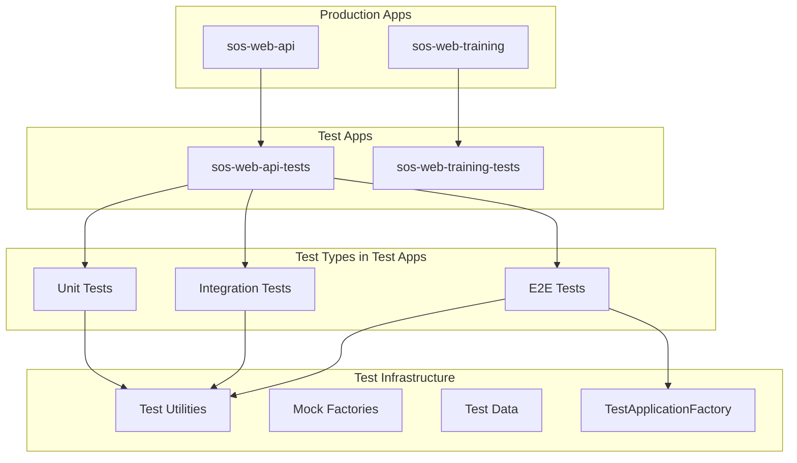

# Testing Architecture Modernization Design

## Overview

This design modernizes the testing architecture for the sos-web-api by implementing a three-tier testing strategy: isolated unit tests, simplified integration tests, and comprehensive E2E tests. The current architecture suffers from complex dependency chains, global mocking issues, and tightly coupled test modules that load the entire AppModule. The new architecture will provide fast, reliable, and maintainable tests through proper isolation, dependency injection overrides, and realistic test data factories.

## Architecture

### Current Issues Analysis

The existing testing setup has several architectural problems:

1. **Complex Module Loading**: Tests load the full AppModule with 15+ feature modules, causing slow startup and complex dependency resolution
2. **Global Mock Pollution**: Global Jest mocks in setup.ts affect all tests and can cause unexpected interactions
3. **Shared State Issues**: Tests share mock state, leading to flaky test results
4. **Poor Isolation**: Unit tests depend on external services like databases and notification systems
5. **Inconsistent Mocking**: Mix of global mocks, service overrides, and manual mocks creates confusion

### New Separated Test Applications Architecture



## Components and Interfaces

### 1. Separated Test Applications Structure

```
apps/                        # Production applications only (no test files)
├── sos-web-api/             # Production API
│   ├── src/
│   ├── package.json         # Production dependencies only
│   └── nest-cli.json
├── sos-web-training/        # Production training app
│   ├── src/
│   ├── package.json         # Production dependencies only
│   └── next.config.js
└── [future-apps]/           # Any new applications follow same pattern

test-apps/                   # Dedicated folder for ALL test applications
├── sos-web-api-tests/       # API test application
│   ├── src/
│   │   ├── unit/           # Isolated service tests
│   │   ├── integration/    # Module interaction tests
│   │   ├── e2e/           # End-to-end workflow tests
│   │   ├── fixtures/      # App-specific test data and factories
│   │   └── utils/         # App-specific test utilities
│   ├── package.json        # Test dependencies + production app as dependency
│   ├── jest.config.js
│   └── tsconfig.json
├── sos-web-training-tests/  # Training app test application
│   ├── src/
│   │   ├── unit/           # Component and utility tests
│   │   ├── integration/    # Page and API integration tests
│   │   ├── e2e/           # Full user workflow tests
│   │   ├── fixtures/      # Test data and mock APIs
│   │   └── utils/         # Test utilities
│   ├── package.json        # Test dependencies + production app as dependency
│   ├── jest.config.js
│   └── playwright.config.js
└── [future-app-tests]/      # Test apps for any new applications

libs/
├── shared-testing/          # Shared test utilities and infrastructure
│   ├── src/
│   │   ├── builders/       # TestModuleBuilder, TestApplicationFactory
│   │   ├── factories/      # Base MockFactory interfaces
│   │   ├── mocks/          # Shared mock implementations (database, external services)
│   │   ├── utils/          # Common test utilities
│   │   └── templates/      # Templates for creating new test applications
│   └── package.json
└── ...
```

### 2. Test Application Configuration

```typescript
// test-apps/sos-web-api-tests/package.json
{
  "name": "@strengthos/sos-web-api-tests",
  "dependencies": {
    "@strengthos/sos-web-api": "file:../../apps/sos-web-api",
    "@strengthos/shared-testing": "file:../../libs/shared-testing",
    "@nestjs/testing": "^11.1.6",
    "jest": "^29.5.0",
    // ... other test dependencies
  }
}
```

### 3. Shared Testing Library Integration

The existing `libs/shared-testing` package should be enhanced to provide:

```typescript
// libs/shared-testing/src/builders/test-module-builder.ts
export class TestModuleBuilder {
  static forService<T>(serviceClass: Type<T>): ServiceTestBuilder<T>;
  static forController<T>(controllerClass: Type<T>): ControllerTestBuilder<T>;
  static forModule(moduleClass: Type<any>): ModuleTestBuilder;
}

// libs/shared-testing/src/factories/base-factory.ts
export interface MockFactory<T> {
  create(overrides?: Partial<T>): T;
  createMany(count: number, overrides?: Partial<T>): T[];
  reset(): void;
}

// libs/shared-testing/src/mocks/database-mocks.ts
export function createMockKnexQueryBuilder(): jest.Mocked<Knex.QueryBuilder>;
export function createMockRepository<T>(): jest.Mocked<BaseRepository<T>>;
```

### 4. Test Application Templates and Automation

To ensure consistency across all applications, the shared-testing library will include:

```typescript
// libs/shared-testing/src/templates/create-test-app.ts
export interface TestAppConfig {
  appName: string;           // e.g., 'sos-web-api'
  appType: 'nestjs' | 'nextjs' | 'express';
  testTypes: ('unit' | 'integration' | 'e2e')[];
}

export function createTestApplication(config: TestAppConfig): void {
  // Generates test-apps/{appName}-tests with proper structure
  // Configures package.json with correct dependencies
  // Sets up Jest/Playwright configuration based on app type
  // Creates example test files following established patterns
}
```

### 5. Monorepo Workspace Configuration

```json
// package.json (root)
{
  "workspaces": [
    "apps/*",
    "test-apps/*",
    "libs/*"
  ]
}
```

### 2. Test Module Builder

```typescript
interface TestModuleBuilder {
  forService<T>(serviceClass: Type<T>): ServiceTestBuilder<T>;
  forController<T>(controllerClass: Type<T>): ControllerTestBuilder<T>;
  forModule(moduleClass: Type<any>): ModuleTestBuilder;
}

interface ServiceTestBuilder<T> {
  withMocks(mocks: MockDefinition[]): ServiceTestBuilder<T>;
  withRealDependencies(deps: Type<any>[]): ServiceTestBuilder<T>;
  build(): Promise<{ service: T; module: TestingModule }>;
}
```

### 3. Mock Factory System

```typescript
interface MockFactory<T> {
  create(overrides?: Partial<T>): T;
  createMany(count: number, overrides?: Partial<T>): T[];
  reset(): void;
}

interface MockDefinition {
  provide: string | symbol | Type<any>;
  useValue?: any;
  useFactory?: (...args: any[]) => any;
  inject?: any[];
}
```

### 4. Test Application Factory

```typescript
interface TestApplicationFactory {
  create(config?: TestAppConfig): Promise<INestApplication>;
  withMocks(mocks: ApplicationMock[]): TestApplicationFactory;
  withModules(modules: Type<any>[]): TestApplicationFactory;
}

interface ApplicationMock {
  module: Type<any>;
  providers: MockDefinition[];
}
```

## Data Models

### Test Configuration Model

```typescript
interface TestConfig {
  database: {
    type: 'mock' | 'memory' | 'test-db';
    connectionString?: string;
  };
  cache: {
    type: 'mock' | 'memory';
  };
  notifications: {
    enabled: boolean;
    mockAll: boolean;
  };
  monitoring: {
    enabled: boolean;
    mockSecurityEvents: boolean;
  };
}
```

### Test Data Models

```typescript
interface UserTestData {
  id: string;
  tenantId: string;
  email: string;
  role: UserRole;
  status: UserStatus;
  // ... other properties
}

interface TenantTestData {
  id: string;
  name: string;
  domain: string;
  status: TenantStatus;
  // ... other properties
}
```

## Error Handling

### Test Error Categories

1. **Setup Errors**: Module compilation failures, dependency injection issues
2. **Mock Errors**: Incorrect mock configurations, missing mock implementations
3. **Assertion Errors**: Test expectation failures with detailed context
4. **Cleanup Errors**: Resource cleanup failures, memory leaks

### Error Handling Strategy

```typescript
class TestErrorHandler {
  static handleSetupError(error: Error, context: TestContext): never;
  static handleMockError(error: Error, mockName: string): never;
  static handleAssertionError(error: Error, testName: string): never;
  static handleCleanupError(error: Error): void;
}
```

## Testing Strategy

### Unit Tests Implementation

**Isolation Strategy:**
- Each service test creates a minimal TestingModule with only the service under test
- All dependencies are mocked using dependency injection overrides
- No global mocks that affect other tests
- Fast execution (< 100ms per test)

**Example Pattern:**
```typescript
describe('UserService', () => {
  let service: UserService;
  let mockRepository: jest.Mocked<UserRepository>;
  
  beforeEach(async () => {
    const { service: testService, mocks } = await TestModuleBuilder
      .forService(UserService)
      .withMocks([
        { provide: UserRepository, useValue: createMockRepository() },
        { provide: 'ILogger', useValue: createMockLogger() }
      ])
      .build();
      
    service = testService;
    mockRepository = mocks.get(UserRepository);
  });
});
```

### Integration Tests Implementation

**Module Testing Strategy:**
- Create test-specific modules with only necessary providers
- Mock external dependencies (database, notifications, monitoring)
- Test service interactions within module boundaries
- Use realistic data flows

**Example Pattern:**
```typescript
describe('UserModule Integration', () => {
  let module: TestingModule;
  
  beforeEach(async () => {
    module = await TestModuleBuilder
      .forModule(UserModule)
      .withMocks([
        { provide: DatabaseService, useValue: createMockDatabase() },
        { provide: 'NotificationService', useValue: createMockNotifications() }
      ])
      .excludeGlobalProviders(['GlobalExceptionFilter'])
      .build();
  });
});
```

### E2E Tests Implementation

**Application Testing Strategy:**
- Use TestApplicationFactory to create full application context
- Mock all external services at application level
- Test complete user workflows through HTTP requests
- Validate end-to-end business logic

**Example Pattern:**
```typescript
describe('User Management E2E', () => {
  let app: INestApplication;
  
  beforeAll(async () => {
    app = await TestApplicationFactory
      .create()
      .withMocks([
        { module: DatabaseModule, providers: [mockDatabaseProviders] },
        { module: NotificationModule, providers: [mockNotificationProviders] }
      ])
      .build();
  });
});
```

### Separated Test Applications Benefits

1. **Build Isolation**: Production builds exclude all test files and dependencies
2. **Dependency Management**: Test-specific dependencies don't affect production bundle size
3. **TypeScript Isolation**: Test compilation issues don't block production builds
4. **Deployment Optimization**: Production deployments contain only necessary code
5. **Development Flexibility**: Tests can use different TypeScript configurations or experimental features

### Test Application Import Strategy

```typescript
// apps/sos-web-api-tests/src/unit/user.service.spec.ts
import { UserService } from '@strengthos/sos-web-api/src/user/services/user.service';
import { UserRepository } from '@strengthos/sos-web-api/src/database/repositories/user.repository';
import { TestModuleBuilder } from '../utils/test-module-builder';

describe('UserService', () => {
  // Test implementation imports production code as external dependency
});
```

### Performance Optimization

1. **Parallel Execution**: Tests run in parallel with proper isolation
2. **Module Caching**: Reuse compiled modules where possible
3. **Mock Optimization**: Lightweight mocks with minimal overhead
4. **Resource Management**: Proper cleanup to prevent memory leaks
5. **Build Separation**: Production builds are faster without test compilation overhead

### Test Data Management

**Factory Pattern Implementation:**
```typescript
class UserFactory implements MockFactory<User> {
  private sequence = 0;
  
  create(overrides: Partial<User> = {}): User {
    return {
      id: `user-${++this.sequence}`,
      tenantId: 'default-tenant',
      email: `user${this.sequence}@example.com`,
      role: UserRole.ATHLETE,
      status: UserStatus.ACTIVE,
      ...overrides
    };
  }
}
```

**Relationship Management:**
```typescript
class TestDataBuilder {
  static createUserWithTenant(userOverrides?: Partial<User>, tenantOverrides?: Partial<Tenant>) {
    const tenant = TenantFactory.create(tenantOverrides);
    const user = UserFactory.create({ tenantId: tenant.id, ...userOverrides });
    return { user, tenant };
  }
}
```

## Migration Strategy

### Phase 1: Infrastructure Setup
1. Create new test directory structure
2. Implement TestModuleBuilder and MockFactory system
3. Create basic test utilities and factories

### Phase 2: Unit Test Migration
1. Migrate service tests to new isolated pattern
2. Replace global mocks with dependency injection overrides
3. Implement comprehensive mock factories

### Phase 3: Integration Test Creation
1. Create simplified integration test modules
2. Implement module-level mocking strategies
3. Test service interactions within bounded contexts

### Phase 4: E2E Test Implementation
1. Implement TestApplicationFactory
2. Create comprehensive application-level mocks
3. Build end-to-end workflow tests

### Phase 5: Optimization and Cleanup
1. Remove old global mocks and setup patterns
2. Optimize test performance and parallel execution
3. Add comprehensive documentation and examples