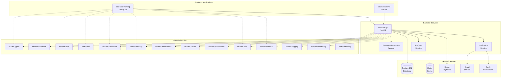
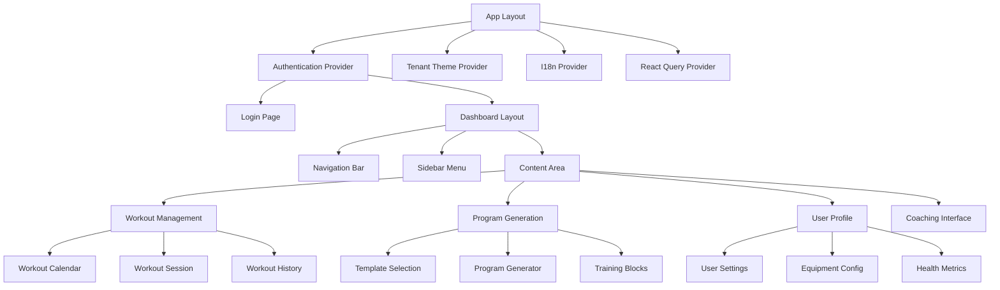
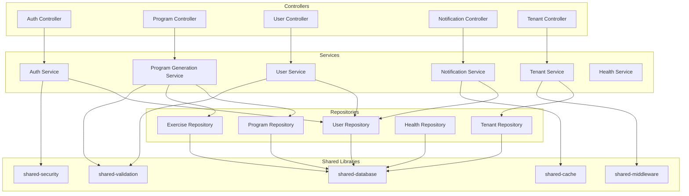
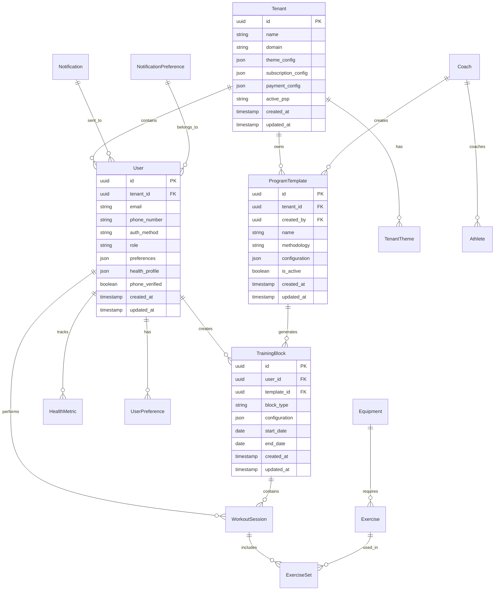
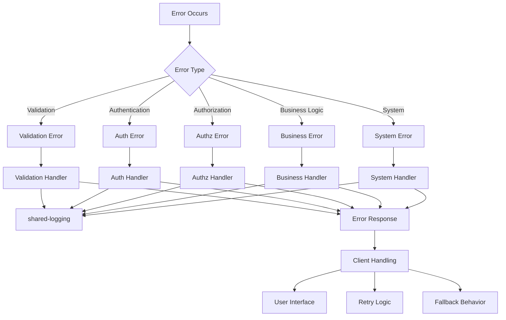
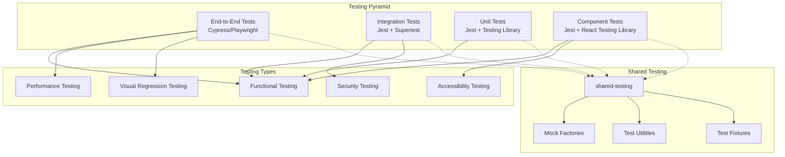
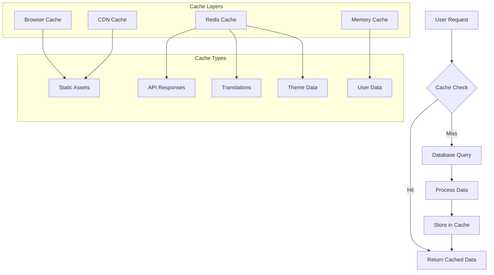
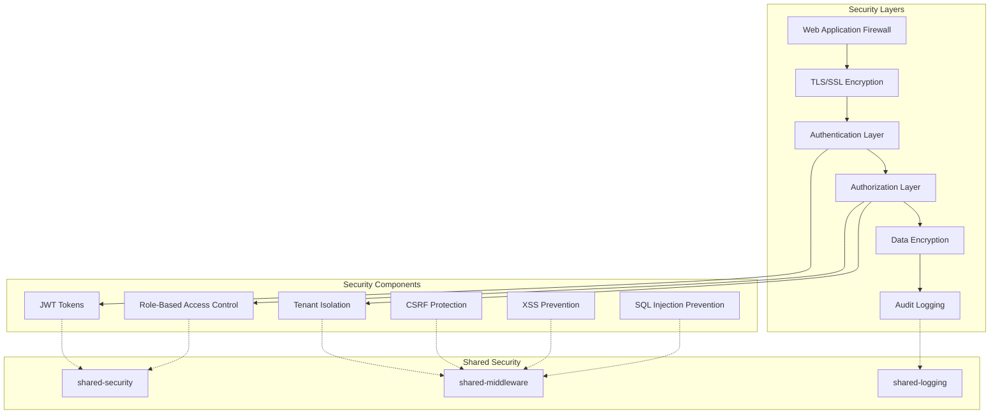
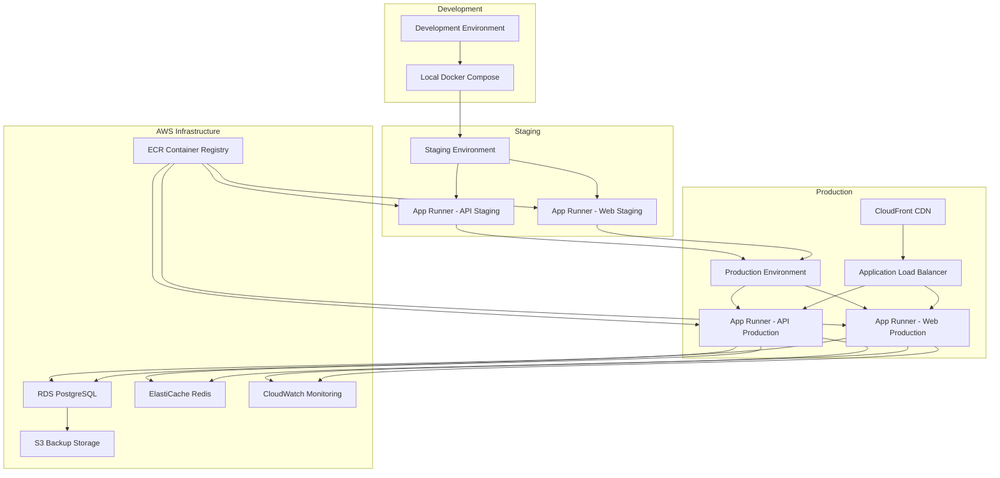

# Unified StrengthOS Design Document

## Overview

The StrengthOS platform is a comprehensive multi-tenant SaaS solution for strength training that integrates intelligent program generation, user management, and modern web interfaces. The system is built on a microservices architecture using shared libraries to ensure consistency, maintainability, and scalability across all components.

The design focuses on incremental improvements to the existing sos-web-training application while ensuring seamless integration with the sos-web-api backend and leveraging the full suite of shared libraries for maximum code reuse and consistency.

## Architecture

### High-Level System Architecture

### Shared Library Integration Strategy

The design emphasizes maximum utilization of shared libraries to ensure consistency and reduce code duplication:

1. **shared-types**: Provides TypeScript interfaces and types used across all applications
2. **shared-database**: Contains database models, migrations, and tenant isolation logic
3. **shared-i18n**: Handles internationalization with caching and API integration
4. **shared-ui**: Provides reusable UI components with theming support
5. **shared-validation**: Contains Zod schemas for data validation
6. **shared-security**: Handles authentication, authorization, and encryption
7. **shared-notifications**: Manages notification delivery across channels
8. **shared-cache**: Provides Redis caching with invalidation strategies
9. **shared-middleware**: Contains common middleware for tenant isolation and security
10. **shared-utils**: Utility functions for formatting, calculations, and common operations

## Components and Interfaces

### Frontend Architecture (sos-web-training)

#### Component Hierarchy

#### Key Frontend Components

1. **Authentication System**
   - Uses shared-security for JWT handling
   - Integrates with sos-web-api auth endpoints
   - Supports multiple authentication methods: email/password, WhatsApp, LINE, OAuth
   - Implements phone number-based registration and login
   - Supports role-based access control
   - Handles token refresh and session management

2. **Tenant Theme System**
   - Uses shared-ui theme components
   - Supports hot-loading of theme changes
   - Integrates with tenant-specific branding
   - Maintains accessibility standards

3. **Internationalization**
   - Uses shared-i18n for translation management
   - Supports locale detection and switching
   - Handles formatting for dates, numbers, currencies
   - Caches translations for performance

4. **API Integration**
   - Uses shared-external for HTTP client
   - Implements proper error handling
   - Supports request/response transformation
   - Integrates with React Query for caching

### Backend Architecture (sos-web-api)

#### Service Layer Design

#### Core Backend Services

1. **Program Generation Service**
   - Implements intelligent program creation algorithms
   - Uses shared-database models for data access
   - Integrates with shared-validation for input validation
   - Supports template-based program generation
   - Handles health metrics and injury considerations

2. **User Management Service**
   - Manages user profiles and preferences with phone number support
   - Handles coaching relationship transitions
   - Uses shared-security for multi-method authentication (email, WhatsApp, LINE)
   - Implements tenant isolation with shared-middleware
   - Supports role-based access control
   - Manages phone number verification and authentication flows

3. **Notification Service**
   - Uses shared-notifications for multi-channel delivery
   - Integrates with shared-i18n for localized messages
   - Supports preference-based notification filtering
   - Handles real-time and scheduled notifications

4. **Tenant Management Service**
   - Manages multi-tenant data isolation
   - Handles tenant-specific configurations
   - Uses shared-middleware for request filtering
   - Supports tenant theme and branding customization

## Data Models

### Core Entity Relationships

### Shared Library Data Models

The system uses shared-database models to ensure consistency across all services:

1. **User Models**: User, UserProfile, UserPreferences, HealthMetrics, AuthenticationMethod, PhoneVerification
2. **Program Models**: ProgramTemplate, TrainingBlock, WorkoutSession, ExerciseSet
3. **Exercise Models**: Exercise, Equipment, MovementPattern, MuscleGroup
4. **Tenant Models**: Tenant, TenantTheme, TenantSubscription, PaymentServiceProvider
5. **Notification Models**: Notification, NotificationPreference, NotificationTemplate, CommunicationChannel
6. **Payment Models**: PaymentProvider, PaymentMethod, PaymentTransaction, SubscriptionPayment

## Error Handling

### Comprehensive Error Management Strategy

#### Error Handling Implementation

1. **Frontend Error Handling**
   - Uses shared-utils error classification
   - Implements retry logic for transient failures
   - Provides user-friendly error messages with shared-i18n
   - Supports graceful degradation for non-critical features

2. **Backend Error Handling**
   - Uses shared-logging for comprehensive error tracking
   - Implements structured error responses
   - Supports error aggregation and monitoring
   - Provides detailed debugging information in development

3. **API Error Responses**
   - Standardized error format across all endpoints
   - Includes error codes, messages, and context
   - Supports localized error messages
   - Provides actionable error information

## Testing Strategy

### Multi-Layer Testing Approach

#### Testing Implementation

1. **Unit Testing**
   - Uses shared-testing utilities for consistent test setup
   - Tests all shared library functions and components
   - Validates business logic and data transformations
   - Ensures proper error handling and edge cases

2. **Integration Testing**
   - Tests API endpoints with real database connections
   - Validates data flow between services
   - Tests authentication and authorization flows
   - Verifies tenant isolation and security

3. **Component Testing**
   - Tests React components with shared-ui integration
   - Validates theming and internationalization
   - Tests user interactions and form submissions
   - Ensures accessibility compliance

4. **End-to-End Testing**
   - Tests complete user workflows
   - Validates cross-application functionality
   - Tests performance under realistic conditions
   - Verifies deployment and production readiness

## Performance Optimization

### Caching Strategy

#### Performance Implementation

1. **Frontend Optimization**
   - Uses React Query for intelligent caching
   - Implements code splitting and lazy loading
   - Optimizes bundle size with tree shaking
   - Uses shared-cache for cross-component data sharing

2. **Backend Optimization**
   - Uses shared-cache (Redis) for frequently accessed data
   - Implements database query optimization
   - Uses connection pooling and query batching
   - Supports horizontal scaling with load balancing

3. **Shared Library Optimization**
   - Optimizes shared-ui components for performance
   - Uses shared-cache for translation and theme data
   - Implements efficient data serialization
   - Supports lazy loading of non-critical features

## Security Architecture

### Multi-Layer Security Implementation

#### Security Implementation

1. **Authentication & Authorization**
   - Uses shared-security for JWT token management
   - Implements role-based access control
   - Supports multi-factor authentication
   - Handles session management and token refresh

2. **Data Protection**
   - Encrypts sensitive data at rest and in transit
   - Implements tenant data isolation
   - Uses shared-middleware for request filtering
   - Supports GDPR compliance and data export

3. **Security Monitoring**
   - Uses shared-logging for security event tracking
   - Implements intrusion detection and prevention
   - Supports security audit trails
   - Provides real-time security alerting

## Deployment Architecture

### AWS App Runner Deployment

#### Deployment Implementation

1. **AWS App Runner Services**
   - Separate App Runner service for sos-web-api (NestJS backend)
   - Separate App Runner service for sos-web-training (Next.js frontend)
   - Uses Docker containers deployed from ECR
   - Implements auto-scaling based on CPU and memory usage
   - Supports rolling deployments with zero downtime

2. **Container Management**
   - Uses ECR (Elastic Container Registry) for container storage
   - Implements multi-stage Docker builds for optimization
   - Supports environment-specific configurations via environment variables
   - Uses shared base images for consistency across services

3. **Infrastructure Services**
   - RDS PostgreSQL for primary database with multi-AZ deployment
   - ElastiCache Redis for caching and session storage
   - CloudFront CDN for static asset delivery and global distribution
   - Application Load Balancer for traffic distribution and SSL termination

4. **Monitoring & Observability**
   - Uses CloudWatch for application and infrastructure monitoring
   - Implements CloudWatch Logs for centralized log aggregation
   - Uses shared-monitoring library for custom application metrics
   - Supports CloudWatch Alarms for automated alerting
   - Integrates with AWS X-Ray for distributed tracing

5. **Security & Networking**
   - VPC with private subnets for database and cache
   - Security groups for network-level access control
   - IAM roles and policies for service-to-service authentication
   - AWS Secrets Manager for sensitive configuration management
   - SSL/TLS termination at the load balancer level

## Integration Points

### External Service Integration

1. **Payment Processing**
   - Flexible Payment Service Provider (PSP) management system
   - Primary integration with Stripe using shared-external
   - Supports multiple PSPs that can be added/removed dynamically
   - PSP abstraction layer for easy integration of new payment providers
   - Supports subscription management across different PSPs
   - Handles webhook processing for multiple payment providers
   - Implements secure payment data handling with PCI compliance
   - Supports regional payment methods and currencies

2. **Communication Services**
   - Uses shared-notifications for multi-channel delivery
   - Supports email, SMS, push notifications
   - Integrates with WhatsApp Business API for authentication and notifications
   - Integrates with LINE Messaging API for authentication and notifications
   - Handles phone number verification via SMS, WhatsApp, and LINE
   - Supports notification preferences and opt-outs across all channels
   - Implements secure messaging for coaching communications

3. **Health Data Integration**
   - Supports wearable device APIs
   - Handles health metric synchronization
   - Implements data validation and processing
   - Supports manual health data entry

4. **Analytics and Reporting**
   - Integrates with analytics platforms
   - Supports custom reporting dashboards
   - Handles data export and visualization
   - Implements privacy-compliant data processing

This design provides a comprehensive foundation for the unified StrengthOS platform, emphasizing shared library usage, incremental development, and scalable architecture that can grow with the platform's needs.