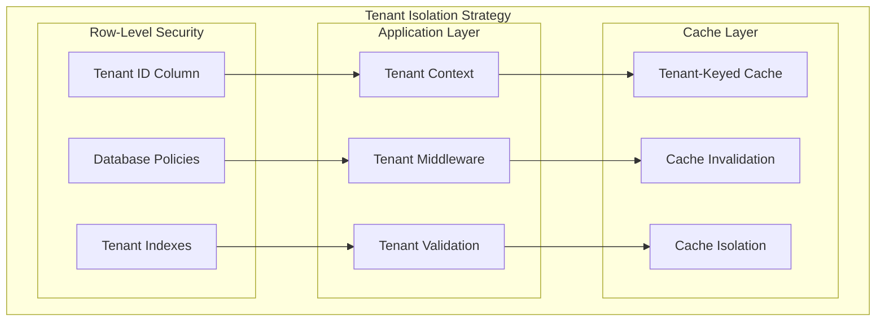

# Design Document

## Overview

The User Management & Multi-Tenancy system serves as the foundational security and access control layer for the StrengthOS platform. This system manages complex multi-tenant relationships, role-based access control, athlete mobility between coaching arrangements, and comprehensive user preferences including equipment, health considerations, and accessibility needs.

The design implements a sophisticated tenant isolation architecture that supports the platform's diverse user roles while ensuring complete data security and privacy. The system handles seamless transitions between coaching arrangements, comprehensive athlete preferences, and integration with external services like Stripe for billing and various authentication providers.

## Architecture

### High-Level Architecture

```mermaid
graph TB
    subgraph "Client Applications"
        UP[User Portal]
        AP[Admin Portal]
        CP[Coach Portal]
        MA[Mobile App]
    end

    subgraph "API Gateway & Auth"
        AG[API Gateway]
        AM[Auth Middleware]
        RL[Rate Limiter]
    end

    subgraph "Core Services"
        UMS[User Management Service]
        TMS[Tenant Management Service]
        ACS[Access Control Service]
        PPS[Preference Service]
        CTS[Coach Transition Service]
        PPS[Payment Processing Service]
    end

    subgraph "Shared Libraries"
        SA[@strengthos/shared-auth]
        SS[@strengthos/shared-security]
        ST[@strengthos/shared-types]
        SI[@strengthos/shared-i18n]
        SC[@strengthos/shared-compliance]
    end

    subgraph "Data Layer"
        PDB[(Primary Database)]
        RDB[(Redis Cache)]
        ADB[(Audit Database)]
    end

    subgraph "External Services"
        PP[Payment Providers]
        PPAY[PromptPay Service]
        BTS[Bank Transfer Service]
        EA[External Auth Providers]
        NS[Notification Service]
        ES[Email Service]
    end

    UP --> AG
    AP --> AG
    CP --> AG
    MA --> AG

    AG --> AM
    AM --> RL
    RL --> UMS
    RL --> TMS
    RL --> ACS
    RL --> PPS
    RL --> CTS
    RL --> PPS

    UMS --> SA
    UMS --> SS
    UMS --> ST
    UMS --> SI
    UMS --> SC

    UMS --> PDB
    UMS --> RDB
    ACS --> ADB

    PPS --> PP
    PPS --> PPAY
    PPS --> BTS
    UMS --> EA
    CTS --> NS
    UMS --> ES
```

### Multi-Tenant Data Architecture



## Components and Interfaces

### User Management Service

**Responsibilities:**

- User authentication and session management
- User profile management with comprehensive preferences
- Password management and security controls
- Integration with external authentication providers

**Key Interfaces:**

```typescript
interface UserManagementService {
  // Authentication
  authenticate(credentials: AuthCredentials): Promise<AuthResult>;
  refreshToken(refreshToken: string): Promise<AuthResult>;
  logout(userId: string, sessionId: string): Promise<void>;

  // User Management
  createUser(userData: CreateUserRequest): Promise<User>;
  updateUser(userId: string, updates: UpdateUserRequest): Promise<User>;
  getUserById(userId: string): Promise<User>;
  deleteUser(userId: string): Promise<void>;

  // Profile Management
  updateProfile(userId: string, profile: AthleteProfile): Promise<AthleteProfile>;
  updatePreferences(userId: string, preferences: UserPreferences): Promise<UserPreferences>;
  updateEquipmentProfile(userId: string, equipment: EquipmentProfile): Promise<EquipmentProfile>;
}

interface AuthCredentials {
  email: string;
  password: string;
  tenantId?: string;
}

interface AuthResult {
  user: User;
  accessToken: string;
  refreshToken: string;
  expiresIn: number;
  permissions: Permission[];
}

interface User {
  id: string;
  tenantId: string;
  email: string;
  role: UserRole;
  profile: AthleteProfile;
  preferences: UserPreferences;
  equipmentProfiles: EquipmentProfile[];
  healthConsiderations: HealthConsiderations;
  createdAt: Date;
  updatedAt: Date;
  lastLoginAt?: Date;
}
```

### Tenant Management Service

**Responsibilities:**

- Tenant creation and management
- Tenant-level configuration and settings
- Data isolation enforcement
- Tenant billing and subscription management

**Key Interfaces:**

```typescript
interface TenantManagementService {
  createTenant(tenantData: CreateTenantRequest): Promise<Tenant>;
  updateTenant(tenantId: string, updates: UpdateTenantRequest): Promise<Tenant>;
  getTenant(tenantId: string): Promise<Tenant>;
  deleteTenant(tenantId: string): Promise<void>;

  // Tenant Configuration
  updateTenantSettings(tenantId: string, settings: TenantSettings): Promise<TenantSettings>;
  getTenantSettings(tenantId: string): Promise<TenantSettings>;

  // Tenant Users
  getTenantUsers(tenantId: string, filters?: UserFilters): Promise<User[]>;
  getTenantStats(tenantId: string): Promise<TenantStats>;
}

interface Tenant {
  id: string;
  name: string;
  domain?: string;
  status: TenantStatus;
  settings: TenantSettings;
  subscription: SubscriptionInfo;
  createdAt: Date;
  updatedAt: Date;
}

interface TenantSettings {
  allowSelfCoached: boolean;
  requireCoachApproval: boolean;
  enableVideoAnalysis: boolean;
  defaultLanguage: string;
  availableLanguages: string[];
  customBranding?: BrandingSettings;
}
```

### Access Control Service

**Responsibilities:**

- Role-based access control enforcement
- Permission management and validation
- Audit logging for security events
- Cross-tenant access prevention

**Key Interfaces:**

```typescript
interface AccessControlService {
  checkPermission(userId: string, resource: string, action: string): Promise<boolean>;
  getUserPermissions(userId: string): Promise<Permission[]>;
  assignRole(userId: string, role: UserRole, assignedBy: string): Promise<void>;
  revokeRole(userId: string, role: UserRole, revokedBy: string): Promise<void>;

  // Audit Logging
  logSecurityEvent(event: SecurityEvent): Promise<void>;
  getAuditLog(filters: AuditFilters): Promise<AuditEntry[]>;

  // Tenant Access
  validateTenantAccess(userId: string, tenantId: string): Promise<boolean>;
  getTenantContext(userId: string): Promise<TenantContext>;
}

interface Permission {
  resource: string;
  actions: string[];
  conditions?: PermissionCondition[];
}

interface SecurityEvent {
  userId: string;
  tenantId: string;
  eventType: SecurityEventType;
  resource: string;
  action: string;
  success: boolean;
  ipAddress: string;
  userAgent: string;
  timestamp: Date;
  metadata?: Record<string, any>;
}

enum UserRole {
  SUPER_ADMIN = 'SUPER_ADMIN',
  COACH_ADMIN = 'COACH_ADMIN',
  COACH = 'COACH',
  ATHLETE = 'ATHLETE',
  SELF_COACHED = 'SELF_COACHED',
}
```

### Preference Service

**Responsibilities:**

- Athlete preference management (equipment, schedule, health)
- Internationalization and localization settings
- Equipment profile management
- Health consideration tracking

**Key Interfaces:**

```typescript
interface PreferenceService {
  // General Preferences
  updateUserPreferences(userId: string, preferences: UserPreferences): Promise<UserPreferences>;
  getUserPreferences(userId: string): Promise<UserPreferences>;

  // Equipment Management
  createEquipmentProfile(userId: string, profile: EquipmentProfile): Promise<EquipmentProfile>;
  updateEquipmentProfile(
    profileId: string,
    updates: Partial<EquipmentProfile>,
  ): Promise<EquipmentProfile>;
  deleteEquipmentProfile(profileId: string): Promise<void>;
  getEquipmentProfiles(userId: string): Promise<EquipmentProfile[]>;

  // Health Considerations
  updateHealthConsiderations(
    userId: string,
    health: HealthConsiderations,
  ): Promise<HealthConsiderations>;
  getHealthConsiderations(userId: string): Promise<HealthConsiderations>;

  // Schedule Management
  updateTrainingSchedule(userId: string, schedule: TrainingSchedule): Promise<TrainingSchedule>;
  getTrainingSchedule(userId: string): Promise<TrainingSchedule>;
}

interface UserPreferences {
  language: string;
  weightUnit: WeightUnit;
  dateFormat: string;
  timeFormat: string;
  timezone: string;
  notifications: NotificationPreferences;
  privacy: PrivacySettings;
}

interface EquipmentProfile {
  id: string;
  userId: string;
  name: string;
  location: string;
  availableEquipment: Equipment[];
  availablePlates: PlateConfiguration;
  isDefault: boolean;
  createdAt: Date;
  updatedAt: Date;
}

interface Equipment {
  type: EquipmentType;
  brand?: string;
  specifications?: EquipmentSpecs;
  limitations?: string[];
}

interface PlateConfiguration {
  unit: WeightUnit;
  availablePlates: number[];
  barWeight: number;
  hasCollars: boolean;
  collarWeight?: number;
}

interface HealthConsiderations {
  disabilities: DisabilityAccommodation[];
  rangeOfMotionLimitations: ROMRestriction[];
  menstrualCycleTracking?: MenstrualCycleSettings;
  injuries: InjuryHistory[];
  medications: MedicationInfo[];
  allergies: string[];
}
```

### Coach Transition Service

**Responsibilities:**

- Managing athlete transitions between coaches
- Data transfer and access control updates
- Transition workflow management
- Notification and approval processes

**Key Interfaces:**

```typescript
interface CoachTransitionService {
  // Transition Requests
  requestCoachChange(
    athleteId: string,
    newCoachId: string,
    reason?: string,
  ): Promise<TransitionRequest>;
  requestSelfCoached(athleteId: string, reason?: string): Promise<TransitionRequest>;
  requestCoaching(athleteId: string, coachId: string): Promise<TransitionRequest>;

  // Transition Management
  approveTransition(requestId: string, approverId: string): Promise<void>;
  rejectTransition(requestId: string, approverId: string, reason: string): Promise<void>;
  cancelTransition(requestId: string, cancelledBy: string): Promise<void>;

  // Transition Execution
  executeTransition(requestId: string): Promise<TransitionResult>;
  rollbackTransition(requestId: string): Promise<void>;

  // Transition History
  getTransitionHistory(athleteId: string): Promise<TransitionHistory[]>;
  getActiveTransitions(coachId?: string): Promise<TransitionRequest[]>;
}

interface TransitionRequest {
  id: string;
  athleteId: string;
  fromCoachId?: string;
  toCoachId?: string;
  transitionType: TransitionType;
  status: TransitionStatus;
  reason?: string;
  requestedAt: Date;
  approvedAt?: Date;
  completedAt?: Date;
  metadata: TransitionMetadata;
}

enum TransitionType {
  COACH_TO_COACH = 'COACH_TO_COACH',
  COACH_TO_SELF = 'COACH_TO_SELF',
  SELF_TO_COACH = 'SELF_TO_COACH',
}

interface TransitionResult {
  success: boolean;
  dataTransferred: DataTransferSummary;
  accessUpdated: AccessUpdateSummary;
  notificationsSent: NotificationSummary;
  errors?: TransitionError[];
}
```

### Payment Processing Service

**Responsibilities:**

- Vendor-agnostic payment processing with multiple provider support
- Regional payment method support (PromptPay, bank transfers, credit cards)
- Usage tracking and billing calculations
- Invoice management and payment reconciliation
- Subscription lifecycle management across different payment methods

**Key Interfaces:**

```typescript
interface PaymentProcessingService {
  // Payment Processing
  processPayment(paymentRequest: PaymentRequest): Promise<PaymentResult>;
  handleWebhook(webhookData: PaymentWebhookData): Promise<void>;

  // Payment Method Management
  addPaymentMethod(tenantId: string, paymentMethod: PaymentMethodData): Promise<PaymentMethod>;
  removePaymentMethod(paymentMethodId: string): Promise<void>;
  getPaymentMethods(tenantId: string): Promise<PaymentMethod[]>;

  // Subscription Management
  createSubscription(
    tenantId: string,
    planId: string,
    paymentMethodId: string,
  ): Promise<Subscription>;
  updateSubscription(subscriptionId: string, updates: SubscriptionUpdate): Promise<Subscription>;
  cancelSubscription(subscriptionId: string, reason?: string): Promise<void>;

  // Payment Processing
  processPayment(paymentIntent: PaymentIntent): Promise<PaymentResult>;
  handleWebhook(webhookData: StripeWebhookData): Promise<void>;

  // Usage Tracking
  trackUsage(tenantId: string, usageData: UsageData): Promise<void>;
  getUsageReport(tenantId: string, period: BillingPeriod): Promise<UsageReport>;

  // Invoice Management
  generateInvoice(subscriptionId: string): Promise<Invoice>;
  getInvoices(tenantId: string, filters?: InvoiceFilters): Promise<Invoice[]>;

  // Payment Provider Management
  getAvailableProviders(region: string): Promise<PaymentProvider[]>;
  switchPaymentProvider(tenantId: string, providerId: string): Promise<void>;
}

interface PaymentRequest {
  tenantId: string;
  amount: number;
  currency: string;
  paymentMethodId: string;
  description?: string;
  metadata?: Record<string, any>;
}

interface PaymentMethod {
  id: string;
  tenantId: string;
  type: PaymentMethodType;
  provider: PaymentProvider;
  details: PaymentMethodDetails;
  isDefault: boolean;
  isActive: boolean;
  createdAt: Date;
  updatedAt: Date;
}

interface PaymentProvider {
  id: string;
  name: string;
  type: PaymentProviderType;
  supportedRegions: string[];
  supportedCurrencies: string[];
  supportedMethods: PaymentMethodType[];
  configuration: ProviderConfiguration;
}

enum PaymentMethodType {
  CREDIT_CARD = 'CREDIT_CARD',
  DEBIT_CARD = 'DEBIT_CARD',
  BANK_TRANSFER = 'BANK_TRANSFER',
  PROMPTPAY = 'PROMPTPAY',
  DIGITAL_WALLET = 'DIGITAL_WALLET',
  CRYPTOCURRENCY = 'CRYPTOCURRENCY',
}

enum PaymentProviderType {
  STRIPE = 'STRIPE',
  PROMPTPAY = 'PROMPTPAY',
  BANK_TRANSFER = 'BANK_TRANSFER',
  OMISE = 'OMISE',
  PAYPAL = 'PAYPAL',
  CUSTOM = 'CUSTOM',
}

interface PaymentMethodDetails {
  // For PromptPay
  promptPayId?: string;
  promptPayType?: 'PHONE' | 'ID_CARD' | 'E_WALLET';

  // For Bank Transfer
  bankName?: string;
  accountNumber?: string;
  accountName?: string;
  routingNumber?: string;
  swiftCode?: string;

  // For Credit/Debit Cards
  last4?: string;
  brand?: string;
  expiryMonth?: number;
  expiryYear?: number;

  // Common fields
  displayName: string;
  isVerified: boolean;
}

interface Subscription {
  id: string;
  tenantId: string;
  externalSubscriptionId?: string; // Provider-specific ID
  planId: string;
  paymentProviderId: string;
  status: SubscriptionStatus;
  currentPeriodStart: Date;
  currentPeriodEnd: Date;
  cancelAtPeriodEnd: boolean;
  usage: UsageMetrics;
  createdAt: Date;
  updatedAt: Date;
}

interface UsageMetrics {
  activeCoaches: number;
  activeAthletes: number;
  storageUsed: number;
  apiCalls: number;
  videoAnalysisMinutes: number;
}
```

## Data Models

### Core User Entities

```typescript
// User Management
interface User {
  id: string;
  tenantId: string;
  email: string;
  passwordHash: string;
  role: UserRole;
  status: UserStatus;
  profile: AthleteProfile;
  preferences: UserPreferences;
  equipmentProfiles: EquipmentProfile[];
  healthConsiderations: HealthConsiderations;
  sessions: UserSession[];
  auditLog: AuditEntry[];
  createdAt: Date;
  updatedAt: Date;
  lastLoginAt?: Date;
  emailVerifiedAt?: Date;
}

interface AthleteProfile {
  firstName: string;
  lastName: string;
  dateOfBirth: Date;
  gender: Gender;
  bodyWeight: number;
  height: number;
  experienceLevel: ExperienceLevel;
  disciplines: Discipline[];
  goals: TrainingGoal[];
  emergencyContact?: EmergencyContact;
  medicalInformation?: MedicalInformation;
}

interface UserPreferences {
  language: string;
  weightUnit: WeightUnit;
  dateFormat: string;
  timeFormat: string;
  timezone: string;
  notifications: NotificationPreferences;
  privacy: PrivacySettings;
  accessibility: AccessibilitySettings;
}

// Equipment and Training Setup
interface EquipmentProfile {
  id: string;
  userId: string;
  name: string;
  location: string;
  description?: string;
  availableEquipment: Equipment[];
  plateConfiguration: PlateConfiguration;
  spaceConstraints?: SpaceConstraints;
  isDefault: boolean;
  isActive: boolean;
  createdAt: Date;
  updatedAt: Date;
}

interface Equipment {
  type: EquipmentType;
  brand?: string;
  model?: string;
  specifications: EquipmentSpecs;
  condition: EquipmentCondition;
  limitations: string[];
  lastMaintenance?: Date;
}

interface PlateConfiguration {
  unit: WeightUnit;
  barWeight: number;
  availablePlates: PlateInventory[];
  hasCollars: boolean;
  collarWeight: number;
  loadingPins: boolean;
  fractionalPlates: FractionalPlateSet;
}

interface PlateInventory {
  weight: number;
  quantity: number;
  material: PlateMaterial;
  type: PlateType;
}

interface FractionalPlateSet {
  has0_25kg: boolean;
  has0_5kg: boolean;
  has1_25lbs: boolean;
  has2_5lbs: boolean;
  customFractionals: number[];
}

// Health and Accessibility
interface HealthConsiderations {
  disabilities: DisabilityAccommodation[];
  rangeOfMotionLimitations: ROMRestriction[];
  menstrualCycleTracking?: MenstrualCycleSettings;
  chronicConditions: ChronicCondition[];
  medications: MedicationInfo[];
  allergies: AllergyInfo[];
  emergencyMedicalInfo?: EmergencyMedicalInfo;
  lastUpdated: Date;
}

interface DisabilityAccommodation {
  type: DisabilityType;
  description: string;
  accommodations: AccommodationRequirement[];
  adaptiveEquipment: AdaptiveEquipment[];
  exerciseModifications: ExerciseModification[];
  isTemporary: boolean;
  startDate: Date;
  endDate?: Date;
}

interface ROMRestriction {
  joint: Joint;
  movementPlane: MovementPlane;
  restrictionType: RestrictionType;
  limitationDegrees?: number;
  affectedExercises: string[];
  compensations: string[];
  isTemporary: boolean;
  startDate: Date;
  endDate?: Date;
}

interface MenstrualCycleSettings {
  trackingEnabled: boolean;
  cycleLength: number;
  lastPeriodStart?: Date;
  symptoms: MenstrualSymptom[];
  trainingAdjustments: CycleTrainingAdjustment[];
  privacyLevel: CyclePrivacyLevel;
  shareWithCoach: boolean;
}

// Training Schedule
interface TrainingSchedule {
  userId: string;
  availableDays: DayAvailability[];
  preferredTimes: TimePreference[];
  sessionDuration: SessionDuration;
  restDayPreferences: RestDayPreference[];
  specialConsiderations: ScheduleConsideration[];
  timezone: string;
  lastUpdated: Date;
}

interface DayAvailability {
  dayOfWeek: number; // 0-6, Sunday = 0
  isAvailable: boolean;
  timeSlots: TimeSlot[];
  notes?: string;
}

interface TimeSlot {
  startTime: string; // HH:MM format
  endTime: string; // HH:MM format
  preference: TimePreference; // PREFERRED, ACCEPTABLE, AVOID
}

// Tenant and Organization
interface Tenant {
  id: string;
  name: string;
  domain?: string;
  status: TenantStatus;
  settings: TenantSettings;
  subscription: SubscriptionInfo;
  billing: BillingInfo;
  users: User[];
  createdAt: Date;
  updatedAt: Date;
  suspendedAt?: Date;
}

interface TenantSettings {
  allowSelfCoached: boolean;
  requireCoachApproval: boolean;
  enableVideoAnalysis: boolean;
  enableAIFeedback: boolean;
  defaultLanguage: string;
  availableLanguages: string[];
  maxCoaches: number;
  maxAthletes: number;
  features: FeatureFlag[];
  customBranding?: BrandingSettings;
  complianceSettings: ComplianceSettings;
}

// Coach-Athlete Relationships
interface CoachAthleteRelationship {
  id: string;
  coachId: string;
  athleteId: string;
  tenantId: string;
  status: RelationshipStatus;
  permissions: CoachPermission[];
  startDate: Date;
  endDate?: Date;
  notes?: string;
  createdAt: Date;
  updatedAt: Date;
}

interface CoachPermission {
  resource: string;
  actions: string[];
  conditions?: PermissionCondition[];
  grantedAt: Date;
  grantedBy: string;
}

// Transition Management
interface TransitionRequest {
  id: string;
  athleteId: string;
  fromCoachId?: string;
  toCoachId?: string;
  transitionType: TransitionType;
  status: TransitionStatus;
  reason?: string;
  approvalRequired: boolean;
  approvedBy?: string;
  approvedAt?: Date;
  executedAt?: Date;
  completedAt?: Date;
  rollbackAt?: Date;
  metadata: TransitionMetadata;
  notifications: TransitionNotification[];
  dataTransfer: DataTransferRecord;
}

interface DataTransferRecord {
  transferredData: string[];
  retainedData: string[];
  archivedData: string[];
  accessUpdates: AccessUpdate[];
  completedAt?: Date;
}
```

### Enums and Constants

```typescript
enum UserRole {
  SUPER_ADMIN = 'SUPER_ADMIN',
  COACH_ADMIN = 'COACH_ADMIN',
  COACH = 'COACH',
  ATHLETE = 'ATHLETE',
  SELF_COACHED = 'SELF_COACHED',
}

enum UserStatus {
  ACTIVE = 'ACTIVE',
  INACTIVE = 'INACTIVE',
  SUSPENDED = 'SUSPENDED',
  PENDING_VERIFICATION = 'PENDING_VERIFICATION',
}

enum TenantStatus {
  ACTIVE = 'ACTIVE',
  SUSPENDED = 'SUSPENDED',
  CANCELLED = 'CANCELLED',
  TRIAL = 'TRIAL',
}

enum TransitionType {
  COACH_TO_COACH = 'COACH_TO_COACH',
  COACH_TO_SELF = 'COACH_TO_SELF',
  SELF_TO_COACH = 'SELF_TO_COACH',
  COACH_ADMIN_REASSIGNMENT = 'COACH_ADMIN_REASSIGNMENT',
}

enum TransitionStatus {
  PENDING = 'PENDING',
  APPROVED = 'APPROVED',
  REJECTED = 'REJECTED',
  IN_PROGRESS = 'IN_PROGRESS',
  COMPLETED = 'COMPLETED',
  CANCELLED = 'CANCELLED',
  FAILED = 'FAILED',
}

enum WeightUnit {
  KG = 'KG',
  LBS = 'LBS',
}

enum Gender {
  MALE = 'MALE',
  FEMALE = 'FEMALE',
  NON_BINARY = 'NON_BINARY',
  PREFER_NOT_TO_SAY = 'PREFER_NOT_TO_SAY',
}

enum DisabilityType {
  MOBILITY = 'MOBILITY',
  VISUAL = 'VISUAL',
  HEARING = 'HEARING',
  COGNITIVE = 'COGNITIVE',
  CHRONIC_PAIN = 'CHRONIC_PAIN',
  NEUROLOGICAL = 'NEUROLOGICAL',
  OTHER = 'OTHER',
}

enum Joint {
  SHOULDER = 'SHOULDER',
  ELBOW = 'ELBOW',
  WRIST = 'WRIST',
  HIP = 'HIP',
  KNEE = 'KNEE',
  ANKLE = 'ANKLE',
  SPINE = 'SPINE',
  NECK = 'NECK',
}

enum CyclePrivacyLevel {
  PRIVATE = 'PRIVATE',
  COACH_ONLY = 'COACH_ONLY',
  AGGREGATED_ONLY = 'AGGREGATED_ONLY',
}
```

## Error Handling

### Error Classification

```typescript
enum ErrorType {
  AUTHENTICATION_ERROR = 'AUTHENTICATION_ERROR',
  AUTHORIZATION_ERROR = 'AUTHORIZATION_ERROR',
  TENANT_ISOLATION_ERROR = 'TENANT_ISOLATION_ERROR',
  VALIDATION_ERROR = 'VALIDATION_ERROR',
  TRANSITION_ERROR = 'TRANSITION_ERROR',
  BILLING_ERROR = 'BILLING_ERROR',
  EXTERNAL_SERVICE_ERROR = 'EXTERNAL_SERVICE_ERROR',
  DATA_INTEGRITY_ERROR = 'DATA_INTEGRITY_ERROR',
}

interface ErrorResponse {
  error: {
    type: ErrorType;
    code: string;
    message: string;
    details?: Record<string, any>;
    timestamp: Date;
    requestId: string;
    userId?: string;
    tenantId?: string;
  };
}
```

### Security Error Handling

- **Authentication Failures**: Rate limiting, account lockout, security notifications
- **Authorization Violations**: Immediate access denial, audit logging, security alerts
- **Tenant Isolation Breaches**: System-level alerts, automatic access revocation
- **Data Privacy Violations**: Compliance notifications, incident response procedures

## Testing Strategy

### Unit Testing

- Service method testing with comprehensive mocking
- Permission and access control logic validation
- Data transformation and validation testing
- Error handling and edge case coverage

### Integration Testing

- Multi-tenant data isolation verification
- External service integration (Stripe, Auth providers)
- Database transaction and rollback testing
- Cache consistency and invalidation testing

### Security Testing

- Penetration testing for tenant isolation
- Authentication and authorization bypass attempts
- SQL injection and data exposure testing
- Privacy compliance validation

### End-to-End Testing

- Complete user registration and onboarding flows
- Coach-athlete relationship management scenarios
- Transition workflows with data verification
- Billing and subscription lifecycle testing

### Performance Testing

- Multi-tenant query performance under load
- Cache effectiveness and hit rates
- Authentication and authorization latency
- Database connection pooling and scaling

The User Management & Multi-Tenancy system provides the secure foundation for the entire StrengthOS platform, ensuring data isolation, comprehensive user management, and flexible coaching arrangements while maintaining strict security and compliance standards.
